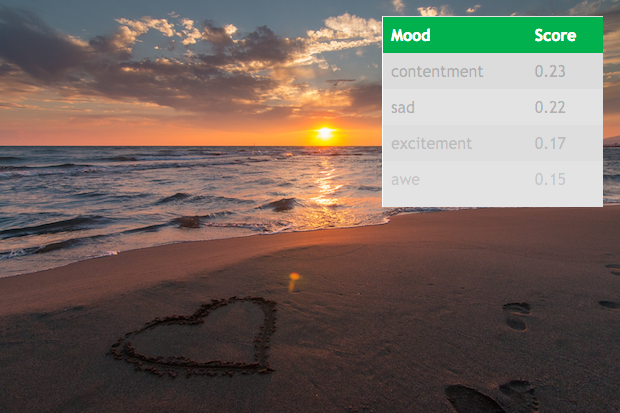

.. ===============LICENSE_START=======================================================
.. Acumos CC-BY-4.0
.. ===================================================================================
.. Copyright (C) 2017-2018 AT&T Intellectual Property & Tech Mahindra. All rights reserved.
.. ===================================================================================
.. This Acumos documentation file is distributed by AT&T and Tech Mahindra
.. under the Creative Commons Attribution 4.0 International License (the "License");
.. you may not use this file except in compliance with the License.
.. You may obtain a copy of the License at
..
..      http://creativecommons.org/licenses/by/4.0
..
.. This file is distributed on an "AS IS" BASIS,
.. WITHOUT WARRANTIES OR CONDITIONS OF ANY KIND, either express or implied.
.. See the License for the specific language governing permissions and
.. limitations under the License.
.. ===============LICENSE_END=========================================================

.. _background:

|Build Status|

===============================
Image Mood Classification Guide
===============================

A model example for compound image classification for emotional impact
and metadata tagging.

Background
==========

This model relies on a first pass with image classification features and
then learns a secondary classification layer. To use this model within
Acumos, one would need to use a model connector available through the
design studio. Using classification outputs from image classifier,
predict the mood of an image into classes (here Amusement, Awe,
Contentment, Excitement, Anger, Disgust, Fear, and Sad).

Adapting a task of image mood classification, this model learns a set of
labels on top of the *image-classifier* output features (some 1000
classification tags). The training data comes from the "art photos"
collection from this `academic
work <https://dl.acm.org/citation.cfm?id=1873965>`__ also posted on the
authors' `publication website <http://www.imageemotion.org/>`__:

::

    Jana Machajdik and Allan Hanbury. 2010. *Affective image classification using features
    inspired by psychology and art theory*. In Proceedings of the 18th ACM international
    conference on Multimedia (MM '10). ACM, New York, NY, USA, 83-92.
    DOI: https://doi.org/10.1145/1873951.1873965

Additionally, the images used to train this model came from a dataset
`available here <http://www.imageemotion.org/testImages_artphoto.zip>`__.

Following original experimental definitions, the model is evaluated by
separating the data into a training and test set using K-fold Cross
Validation (K = 5). Original performance metrics comparing methods on
this data are shown below, as found in the
`original publication <https://dl.acm.org/citation.cfm?id=1873965>`__.

Usage
-----

Input to the model is an array of multiple classification scores for
each image. Specifically, an image index, a class name, and the
probability of that class are expected as inputs. Outputs of the model
will contain a similar format except that they will be created in the
domain of the mood classifier classes: image index, mood class name, and
probability score. The probabilities are normalized to sum to 1.0 over
all values so that they can utilized as relative confidence scores.

A web demo is included with the source code, available via the
`Acumos Gerrit repository <https://gerrit.acumos.org/r/gitweb?p=image-mood-classifier.git;a=summary>`__
or the mirrored
`Acumos Github repository <https://github.com/acumos/image-mood-classifier>`__. It
utilizes a protobuf javascript library and a few image examples to
classify and display the top N detected mood scores, as illustrated in
the model image.

Once deployed, you can quickly jump to the
`default webhost page <http://htmlpreview.github.io/?https://github.com/acumos/image-mood-classifier/blob/master/web_demo/image-mood-classes.html>`__
and point to your model for a demo; see
`a web demonstration <tutorials/demonstration.rst>`__

Performance
-----------

The model has a few training modes, but the algorithm below (random
forest) seemed to perform the best between non neural-net computations.
The training and evaluation is completed wholly though
`scikit-learn <http://scikit-learn.org/>`__ to demonstrate the utility
of simple pipeline wrapping for an Acumos model.

(Random Forest - 300 estimators); (**the default**)

+--------------+-----------+--------+----------+--------------+
| Class        | precision | recall | f1-score | sample count |
+==============+===========+========+==========+==============+
| Amusement    | 0.29      | 0.27   | 0.28     | 22           |
+--------------+-----------+--------+----------+--------------+
| Anger        | 0.25      | 0.10   | 0.14     | 10           |
+--------------+-----------+--------+----------+--------------+
| Awe          | 0.37      | 0.37   | 0.37     | 19           |
+--------------+-----------+--------+----------+--------------+
| Contentment  | 0.50      | 0.45   | 0.48     | 11           |
+--------------+-----------+--------+----------+--------------+
| Disgust      | 0.21      | 0.27   | 0.24     | 11           |
+--------------+-----------+--------+----------+--------------+
| Excitement   | 0.38      | 0.31   | 0.34     | 26           |
+--------------+-----------+--------+----------+--------------+
| Fear         | 0.38      | 0.55   | 0.44     | 22           |
+--------------+-----------+--------+----------+--------------+
| Sad          | 0.29      | 0.29   | 0.29     | 41           |
+--------------+-----------+--------+----------+--------------+
| avg / total  | 0.33      | 0.33   | 0.33     | 162          |
+--------------+-----------+--------+----------+--------------+

More Information
----------------

Future work for this model may include increased sample count,
additional learning algorithm evaluation, and the inclusion of raw
features in addition to image classes. The image classes alone lack some
deeper information (e.g. color, texture, etc.) that is typically
associated with (and causes variations in) mood. Additionally, there are
some performance differences detected as the resolution of the input
image is varied, likely due to the original image classifier performing
poorly with small-resolution objects.

Source Installation
===================

This section is useful for source-based installations and is not
generally intended for catalog documentation.

Package dependencies
--------------------

Package dependencies for the core code and testing have been flattened
into a single file for convenience. Instead of installing this package
into your your local environment, execute the command below.

**Note:** If you are using an `anaconda-based environment <https://anaconda.org>`__,
you may want to try installing with conda first and then pip.

.. code:: bash

    conda install --yes --file requirements.txt  # suggested first step if you're using conda

Installation of the package requirements for a new environment.

.. code:: bash

    pip install -r requirements.txt

Usage
-----

This package contains runable scripts for command-line evaluation,
packaging of a model (both dump and posting), and simple web-test uses.
All functionality is encapsulated in the ``classify_image.py`` script
and has the following arguments.

.. code:: bash

    usage: classify_image.py [-h] [-p PREDICT_PATH] [-i INPUT] [-C CUDA_ENV]
                             [-l LABELS] [-m {svm,rf}] [-f] [-n] [-a PUSH_ADDRESS]
                             [-A AUTH_ADDRESS] [-d DUMP_MODEL] [-s SUMMARY]

    optional arguments:
      -h, --help            show this help message and exit

    main execution and evaluation functionality:
      -p PREDICT_PATH, --predict_path PREDICT_PATH
                            Save predictions from model (model must be provided
                            via 'dump_model')
      -i INPUT, --input INPUT
                            Absolute path to input training data file. (for now
                            must be a header-less CSV)
      -C CUDA_ENV, --cuda_env CUDA_ENV
                            Anything special to inject into CUDA_VISIBLE_DEVICES
                            environment string

    model creation and configuration options:
      -l LABELS, --labels LABELS
                            Path to label one-column file with one row for each
                            input
      -m {svm,rf}, --model_type {svm,rf}
                            specify the underlying classifier type (rf
                            (randomforest), svc (SVM))
      -f, --feature_nomask  create masked samples on input
      -n, --add_softnoise   do not add soft noise to classification inputs
      -a PUSH_ADDRESS, --push_address PUSH_ADDRESS
                            server address to push the model (e.g.
                            http://localhost:8887/upload)
      -A AUTH_ADDRESS, --auth_address AUTH_ADDRESS
                            server address for login and push of the model (e.g.
                            http://localhost:8887/auth)
      -d DUMP_MODEL, --dump_model DUMP_MODEL
                            dump model to a pickle directory for local running
      -s SUMMARY, --summary SUMMARY
                            summarize top N image classes are strong for which
                            label class (only in training)

Sample image examples can be found in the
`web_demo/images <web_demo/images>`__ directory.

Example Images
--------------

For the purpose of testing the classifier a few sample images are
provided. While these images are licensed for use here as described in
the LICENSE.txt file at the root of this repo, the original author may
retain some rights. See the source link for more info on the specific
license of each image.

-  `awe 1 <web_demo/images/example_awe_1.jpg>`__ -
   `flickr source <https://flic.kr/p/RLzkvA>`__
-  `excitement 1 <web_demo/images/example_excitement_1.jpg>`__ -
   `flickr source <https://flic.kr/p/fN8y4d>`__
-  `excitement 2 <web_demo/images/example_excitement_2.jpg>`__ -
   `pexels source <https://www.pexels.com/photo/red-green-hot-air-balloon-during-daytime-51377/>`__
-  `sad 1 <web_demo/images/example_sad_1.jpg>`__ -
   `flickr source <https://flic.kr/p/8Kmqib>`__

Example Usages
==============

Please consult the `tutorials <tutorials>`__ dirctory for usage
examples or jump right to `deployment <tutorials/deployment.rst>`__
to get started.

Release Notes
=============

The `release notes <release-notes.rst>`__ catalog additions and
modifications over various version changes.

.. |Build Status| image:: https://jenkins.acumos.org/buildStatus/icon?job=image-classification-tox-verify-master
   :target: https://jenkins.acumos.org/job/image-classification-tox-verify-master/