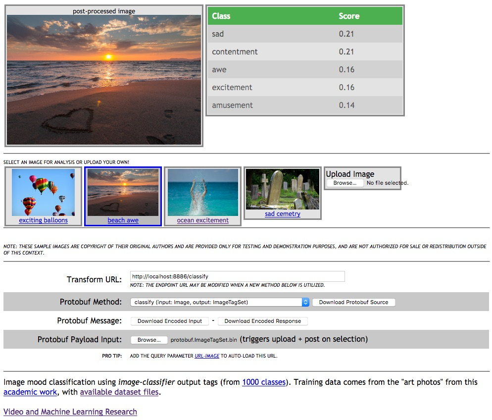

<!---
.. ===============LICENSE_START=======================================================
.. Acumos CC-BY-4.0
.. ===================================================================================
.. Copyright (C) 2017-2018 AT&T Intellectual Property & Tech Mahindra. All rights reserved.
.. ===================================================================================
.. This Acumos documentation file is distributed by AT&T and Tech Mahindra
.. under the Creative Commons Attribution 4.0 International License (the "License");
.. you may not use this file except in compliance with the License.
.. You may obtain a copy of the License at
..
..      http://creativecommons.org/licenses/by/4.0
..
.. This file is distributed on an "AS IS" BASIS,
.. WITHOUT WARRANTIES OR CONDITIONS OF ANY KIND, either express or implied.
.. See the License for the specific language governing permissions and
.. limitations under the License.
.. ===============LICENSE_END=========================================================
-->

# Web Demo
This web page sample allows the user to submit an image to
an image classification and image mood classification service
in serial progression.

** Image Copyrights May Apply ** - the included sample videos may carry
additional copyrights and are not meant for public resale or consumption.

## Browser Interaction
Most browsers should have no
CORS or other cross-domain objections to dropping the file `image-mood-classes.html`
into the browser and accesing a locally hosted server API, as configured
in [the previous tutorial](lesson2.md).

## Example mood classification demo
To customize this demo, one should change either the included javascript
or simply update the primary classification URL on the page itself during runtime.

* confirm that your local instance is configured and running
* download this directory to your local machine
  * confirm the host port and classification service URL in the file `image-mood-classes.js`
```
classificationServer: "http://localhost:8886/classify",
```

* view the page `image-mood-classes.html` in a Crome or Firefox browser
* probabilities will be updated on the right side fo the screen
* you can switch between a few sample images or upload your own by clicking on the buttons below the main image window

Example web application with *awe* mood classification

* 
