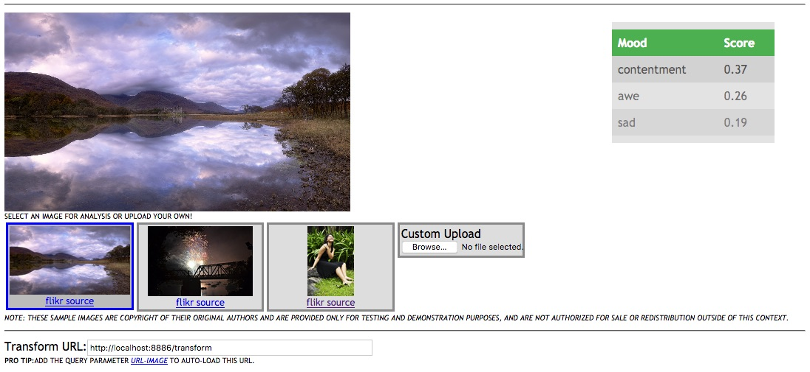

# Image Mood Classifier Example
This web page sample allows the user to submit an image to
an image classification and image mood classification service
in serial progression.

** Image Copyrights May Apply ** - the included sample videos may carry
additional copyrights and are not meant for public resale or consumption.

## Example mood classification demo
To utilize this demo...

* confirm that your local instance is configured and running
* download this directory to your local machine
  * confirm the host port and classification service URL in the file `image-classes.js`
```
classificationServer: "http://localhost:8885/transform",
moodServer: "http://localhost:8886/transform",
```

* view the page `image-mood-classes.html` in a Crome or Firefox browser
* probabilities will be updated on the right side fo the screen
* you can switch between a few sample videos by clicking on the buttons below the main video player
*  
